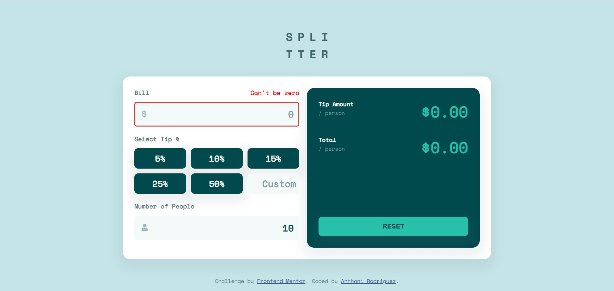

# Frontend Mentor - Order summary card solution

This is a solution to the [Order summary card challenge on Frontend Mentor](https://www.frontendmentor.io/challenges/order-summary-component-QlPmajDUj). Frontend Mentor challenges help you improve your coding skills by building realistic projects. 

## Overview

### The challenge

Users should be able to:

- See hover states for interactive elements

### Links

- Solution URL: [Add solution URL here](https://www.frontendmentor.io/solutions/html-sass-jquery-r4VM6cqJo)
- Live Site URL: [Add live site URL here](https://ecstatic-spence-0312bb.netlify.app/)

## My process

### Built with

- Semantic HTML5 markup
- CSS custom properties
- Flexbox
- Mobile-first workflow
- NodeSass
- JQuery